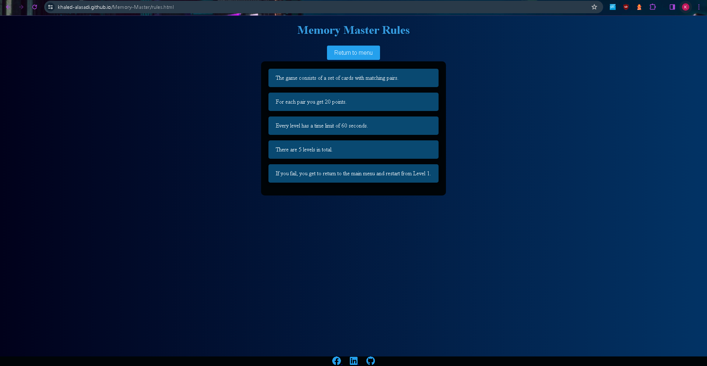
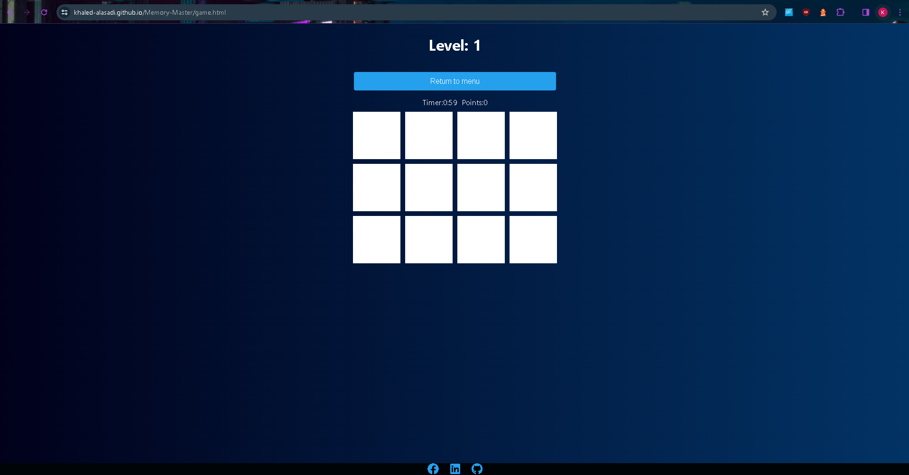
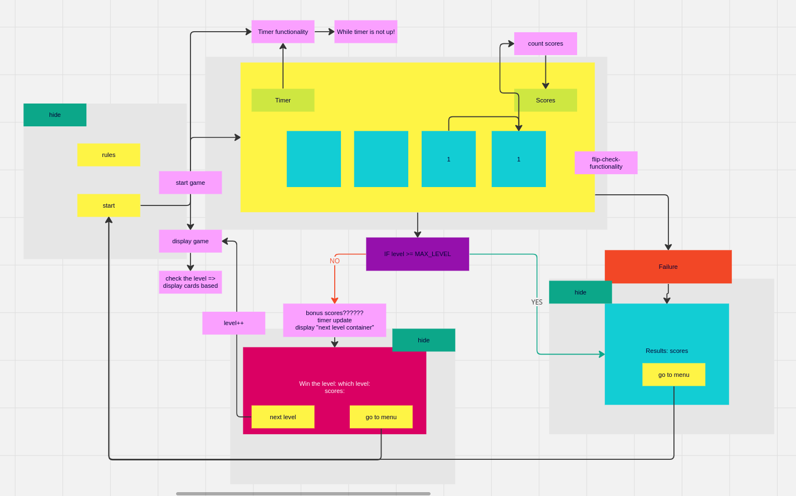

# *Memory-Master*

"Memory-Master app was built with the overarching goal of providing users with an entertaining and effective tool to enhance their memory skills.

The site can be accessed by this [link](https://khaled-alasadi.github.io/Memory-Master/index.html)

---
## User Stories

### First Time Visitor Goals:

* As a First Time Visitor, I want to easily understand the main purpose of the app, so I can learn more about this app.
* As a first-time visitor, I want to explore the features and interface of Memory-Master to understand how the game works.
* As a newcomer, I want to be able to start playing the game quickly without feeling overwhelmed by complex instructions.

### Returning VisitorGoals:

* As a Returning Visitor, I want to refresh my memory by playing more.

## Features

+ ### Menu Page

    - Represent: 

        * the main goal of the application.
        * Provides options for rules and game pages.

    - Menu page has 2 main buttons:

        1. Start Game Button leads to the page where the user can play the game;

        2. Rules Button leads to the page where the user can learn the rules before playing;

    - It also has a footer at the bottom with social media icons;

    
​
---

+ ### Rules Page

    - It has a button which leads to the menu page;
    - It has a set of rules that explains the game;

    

---

+ ### Game Page

    - It has a button which leads to the menu page;
    - It has a a level at the top that shows which level the player is currently on;
    - It has a point tracker that registers the points for each matching pair and each level;
    - It has a timer that counts down a minute;
    - It has a modal that shows up on completing or failing the level;

    

---

## Flowchart

The flowchart represent the logic of the application:

  

---

## Technologies Used

- [HTML](https://developer.mozilla.org/en-US/docs/Web/HTML) was used as the foundation of the site.
- [CSS](https://developer.mozilla.org/en-US/docs/Web/css) - was used to add the styles and layout of the site.
- [CSS Grid](https://developer.mozilla.org/en-US/docs/Web/CSS/grid) - was used to make position the play cards.
- [JS](https://www.w3schools.com/js/) - was used to add interactivity to the site.
- [Balsamiq](https://balsamiq.com/) was used to make wireframes for the website.
- [VSCode](https://code.visualstudio.com/) was used as the main tool to write and edit code.
- [Git](https://git-scm.com/) was used for the version control of the website.
- [GitHub](https://github.com/) was used to host the code of the website.

---
## Design

Deep Dark Blue was used for the background.

White was used for the text.

light blue was used for the buttons.

---

### Bugs
+ **Unsolved bugs**

    - None.

---
## Testing

Please refer to the [TESTING.md](TESTING.md) file for all test-related documentation.

---
## Deployment

- The site was deployed to GitHub pages. The steps to deploy are as follows: 
  - In the [GitHub repository](https://github.com/Khaled-AlAsadi/Memory-Master.git), navigate to the Settings tab 
  - From the source section drop-down menu, select the **Main** Branch, then click "Save".
  - The page will be automatically refreshed with a detailed ribbon display to indicate the successful deployment.

The live link can be found [here](https://khaled-alasadi.github.io/Memory-Master/index.html)

---

## Local Deployment

In order to make a local copy of this project, you can clone it.
In your IDE Terminal, type the following command to clone my repository:

- `git clone https://github.com/Khaled-AlAsadi/Memory-Master.git`

---

## Credits

+ #### Content

  - Inspiration for the come from my friends whose children are put in tough position at schools nowadays.
  - IPA for each word was taken from [Cambridge Dictionary](https://dictionary.cambridge.org/).

+ #### Media

---

## Acknowledgements

---

## Wireframes

### Mobile devices

### Tablet devices

### Desktop devices

