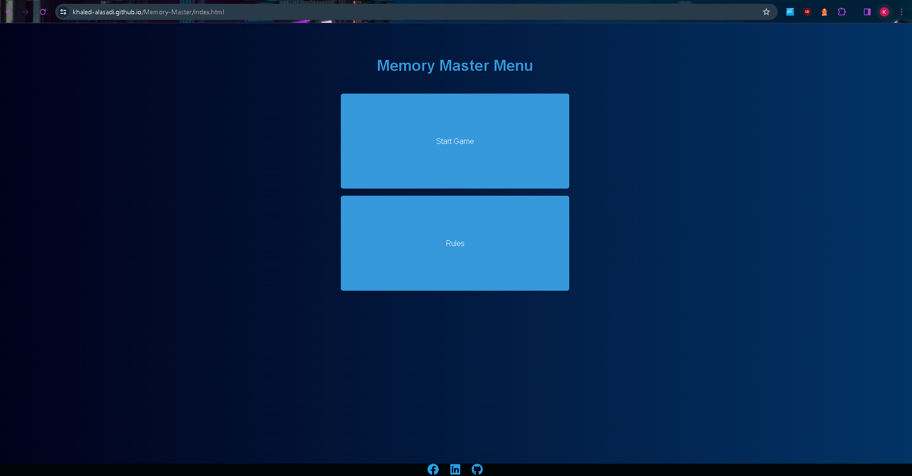
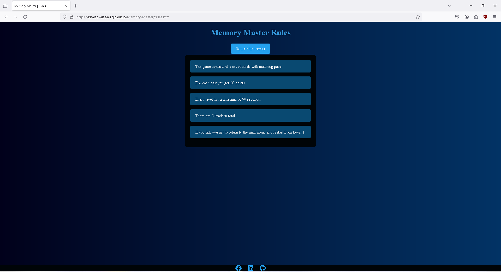
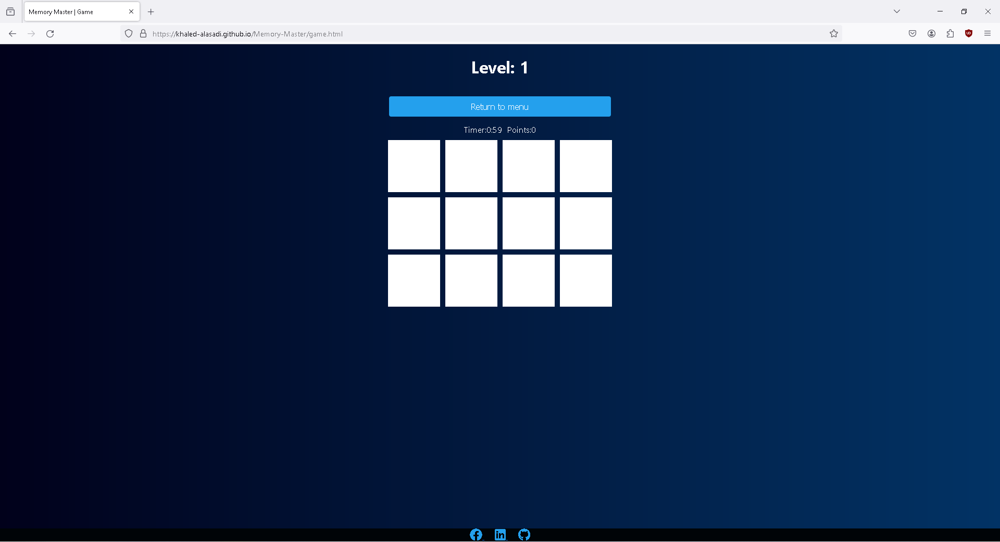
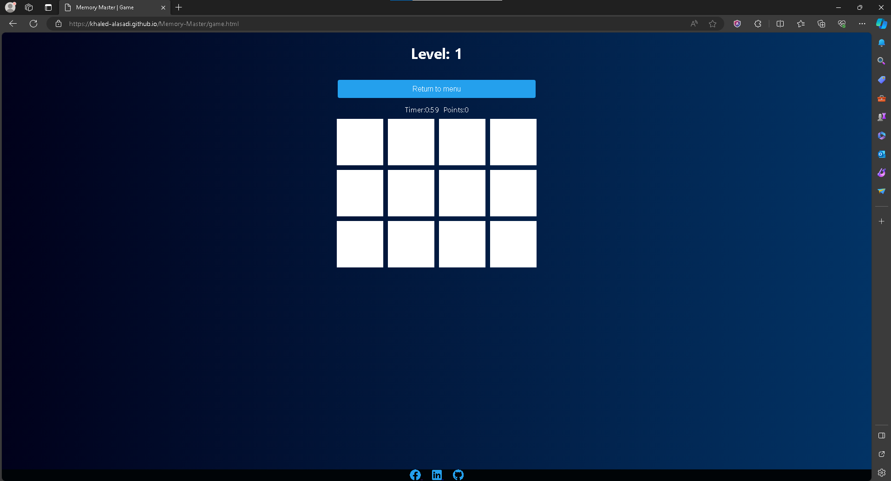
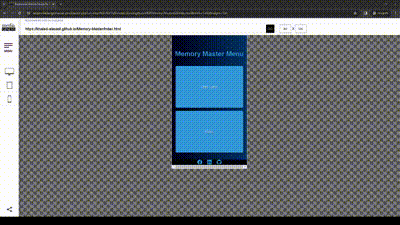
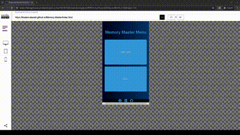
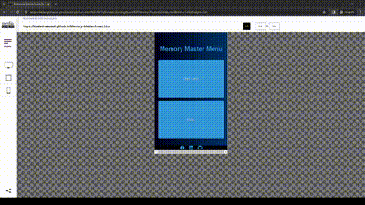
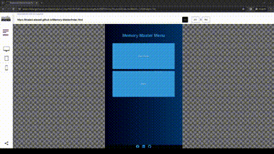
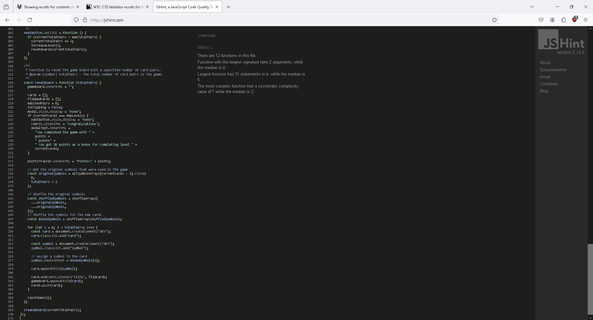
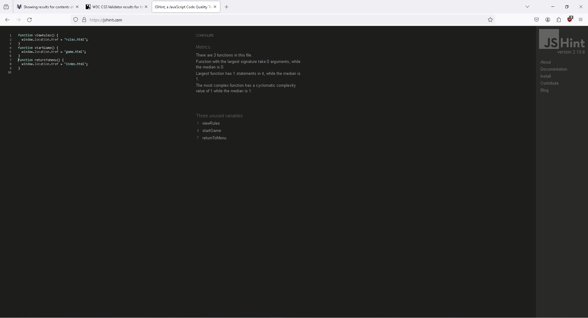

# Testing

## **COMPATIBILITY:**

+ The app was tested on the following browsers: Chrome, Firefox, Brave, Edge:

  - Chrome:

  
  
  
  
  - Firefox:

  
  
  

  - Edge:

  
  
  

## Devtools testing

+ The app was checked by devtools implemented on Firefox and Chrome browsers.

## Responsiveness testing

+ The app was checked with [Responsive Website Design Tester](https://responsivedesignchecker.com/).

  1. Mobile Screens:

      - Mobile 320x480:

      

      - Mobile 320x568:

      

      - Mobile 360x640:

      

      - Mobile 375x667:

      

      - Mobile 384x640:

      

      - Mobile 411x731:

      

      - Mobile 414x736:

      
      
  1. Tablets Screens:

      - Tablet 600x960:
        
      

      - Tablet 768x1024:

      

      - Tablet 800x1280:
        
      

      - Tablet 1366x1024:

      
      
  1. Desktop Screens:

      - Desktop 1024x600:
        
      

      - Desktop 1024x800:

      

      - Desktop 1366x768:
        
      

      - Desktop 1440x900:

      

      - Desktop 1600x900:
        
      

      - Desktop 1680x1050:

      

      - Desktop 1920x1080:
        
      

      - Desktop 1920x1200:

      

+ The functionality of the links in the app was checked as well by different users.

---

## Manual testing

| feature | action | expected result | tested | passed | comments |
| --- | --- | --- | --- | --- | --- |
| Menu Page | | | | | |
| Start Game | Click on Start Game button | The user is redirected to the game page | Yes | Yes | - |
| Rules | Click on Rules button | The user is redirected to the rules page | Yes | Yes | - |
| Rules Page | | | | | |
| Return to menu | Click on Return to menu button | The user is redirected to the menu page | Yes | Yes | - |
| Game Page | | | | | |
| Return to menu | Click on Return to menu button | The user is redirected to the menu page | Yes | Yes | - |
| Game Board | Click on card  | The card flips and shows the symbol | Yes | Yes | - |
| Matching pair of cards | Click on cards until a match between cards happen  | The points tracker adds 20 points | Yes | Yes | - |
| Timer | The user redirects to the game page  | The counter starts counting down | Yes | Yes | - |
| Footer | | | | | |
| LinkedIn icon in the footer | Click on the LinkedIn icon | The user is redirected to the LinkedIn page | Yes | Yes | - |
| Facebook icon in the footer | Click on the Facebook icon | The user is redirected to the Facebook page | Yes | Yes | - |
| Github icon in the footer | Click on the Github icon | The user is redirected to the Github page | Yes | Yes | - |

---

## Validator testing

+ ### HTML
    - No errors or warnings were found when passing through the official [W3C](https://validator.w3.org/) validator.
      - Menu Page:
          
      - Rules Page:
          
      - Game Page:
          
    
+ ### CSS
    - No errors or warnings were found when passing through the official [W3C (Jigsaw)](https://jigsaw.w3.org/css-validator/#validate_by_uri) 
    
    
    

+ ### JS
    - No errors or warnings were found when passing through the official [JSHint](https://jshint.com/) validator except the warnings that   

      - Script:

          

      - Function:

          
          
          - I decided to have a different javascript file where i only define the functions for the navigation. In the picture it says that the functions are not being used but i use them in the html files

## Accessibility and performance

- Using PageSpeed Insights I confirmed that the website is performing well, accessible and colors and fonts chosen are readable.

  - Menu Page:

      

  - Rules Page:

      

  - Game Page:

      
